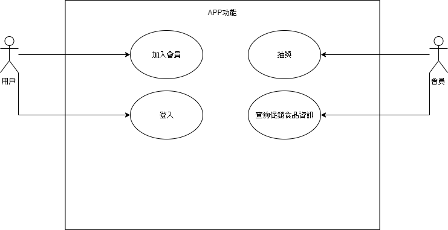
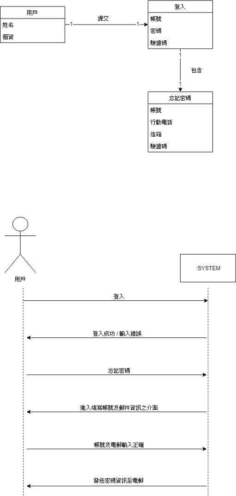
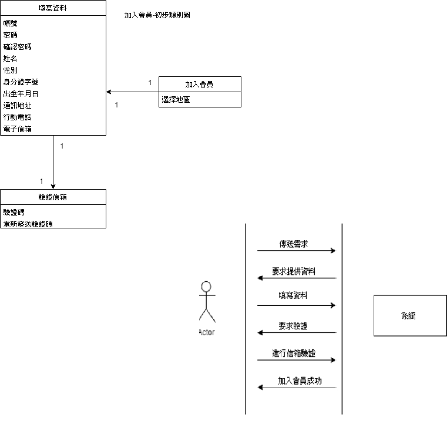
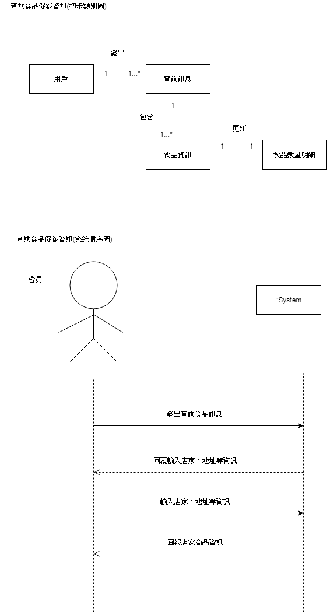
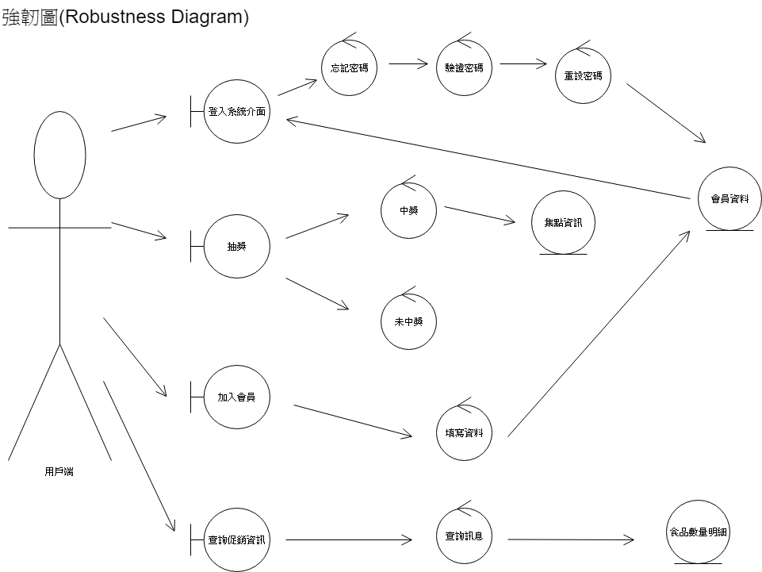

# 友善食光

### 一、需求清單:

1. 消費者能夠透過手機得知全家期品相關資訊

2. 手機平台能夠自動更新資訊，通知消費者折扣資訊

3. 店員能夠編輯產品相關

### 二、功能性需求與非功能性需求:

功能性需求:

1. 使用者介面規劃設計

2. 建構資料庫

3. 撰寫APP程式

4. 將APP與資料庫連結

非功能性需求:

1. 程式需要順暢

2. 整體設計需要省時

3. 開發需要介面人性化

4. 開發成本越低越好

5. 符合法律規定

### 三、使用案例圖:

### 四、app功能-使用案例:

                                 
🔥主要功能 

1. 產品即將變為即期品                                     

2. app顯示即期品的相關資訊

3. 消費者前往購買
 
4. app更新產品數量

🌊替代路徑

3.1消費者在產品過期前都沒有購買 

4.1app顯示產品被銷毀

### 五、User story:

1. 身為一個{{會員}},我希望能有{{提醒功能}}以便能讓我{{知道何時前往購買}}。

2. 身為一個{{會員}},我希望能有{{抽獎功能}}以便能讓我{{得到更多優惠}}。

3. 身為一個{{店長}},我希望能有{{時限系統}}以便能讓我{{管控食物品質}}。

### 初步類別圖及系統循序圖

### 強韌圖

